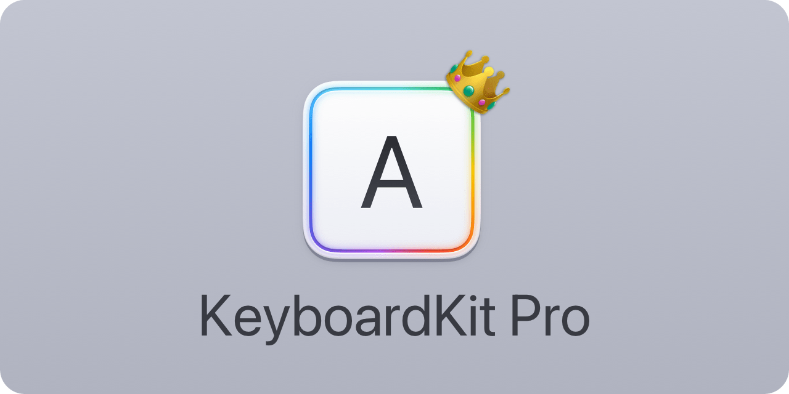

<p align="center">
    
</p>

<p align="center">
    
    
    
    <a href="https://keyboardkit.github.io/KeyboardKit"></a>
</p>


## About KeyboardKit Pro

[KeyboardKit][KeyboardKit] lets you create amazing [custom keyboards][About] with a few lines of code, using Swift & SwiftUI.

<p align="center">
    
</p>

KeyboardKit extends Apple's limited keyboard APIs with more capabilities. KeyboardKit Pro extends further by unlocking localized keyboards, autocomplete, an emoji keyboard, AI support, themes, and much more.
 


## Commercial License

KeyboardKit Pro requires a license to be used. You can sign up on the [KeyboardKit website][Website] or the [Gumroad store][Gumroad].


## Installation

KeyboardKit Pro can be installed with the Swift Package Manager:

```
https://github.com/KeyboardKit/KeyboardKitPro.git
```

> [!IMPORTANT]  
> Unlike KeyboardKit, KeyboardKit Pro is a binary target and must only be linked to the app target.


## Getting started

The easiest way to set up KeyboardKit is to first create a `KeyboardApp` value for your app:

```swift
extension KeyboardApp {

        static var keyboardKitDemo: KeyboardApp {
        .init(
            name: "KeyboardKit",
            licenseKey: "your-key-here",                // Sets up KeyboardKit Pro!
            appGroupId: "group.com.keyboardkit.demo",   // Sets up App Group data sync
            locales: .keyboardKitSupported,             // Sets up the enabled locales
            autocomplete: .init(                        // Sets up custom autocomplete  
                nextWordPredictionRequest: .claude(...) // Sets up AI-based prediction
            ),
            deepLinks: .init(app: "kkdemo://", ...)     // Defines how to open the app
        )
    }
}
```  

Next, let your `KeyboardController` inherit ``KeyboardInputViewController`` instead of `UIInputViewController`:

```swift
class KeyboardController: KeyboardInputViewController {}
```

This unlocks additional functions and capabilities, and injects `services` and observable `state` to the controller. 

Next, override `viewDidLoad()` and call `setupPro(for:)` with your app value:

```swift
class KeyboardViewController: KeyboardInputViewController {

    override func viewDidLoad() {
        super.viewDidLoad()
        
        setup(for: .keyboardKitDemo) { result in
            // If result is successful, KeyboardKit Pro is now active
            // You can now customize your keyboard and tweak features 
        }
    }
}
```

To replace or customize the standard `KeyboardView` view, just override `viewWillSetupKeyboardView()` and call `setupKeyboardView(with:)` with the view that you want to use:

```swift
class KeyboardViewController: KeyboardInputViewController {

    override func viewWillSetupKeyboardView() {
        setupKeyboardView { [weak self] controller in // <-- Use weak or unknowned self!
            KeyboardView(
                state: controller.state,
                services: controller.services,
                buttonContent: { $0.view },
                buttonView: { $0.view },
                collapsedView: { $0.view },
                emojiKeyboard: { $0.view },
                toolbar: { $0.view }
            )
        }
    }
}
```

To set up your main app with the same keyboard configuration, just wrap the content view in a `KeyboardAppView`:

```swift
@main
struct MyApp: App {

    var body: some Scene {
        WindowGroup {
            KeyboardAppView(for: .keyboardKitDemo) {
                ContentView()
            }
        }
    }
}
```

For more information, see the [getting started guide][Getting-Started] and [essentials][Essentials] articles.


## Localization

KeyboardKit supports [71 keyboard-specific locales][Localization]:

🇺🇸 🇦🇱 🇦🇪 🇦🇲 🇧🇾 🇧🇬 🇦🇩 🏳️ 🏳️ 🇭🇷  <br />
🇨🇿 🇩🇰 🇳🇱 🇧🇪 🇦🇺 🇨🇦 🇬🇧 🇺🇸 🇪🇪 🇫🇴  <br />
🇵🇭 🇫🇮 🇫🇷 🇨🇦 🇧🇪 🇨🇭 🇬🇪 🇩🇪 🇦🇹 🇨🇭  <br />
🇬🇷 🇺🇸 🇮🇱 🇭🇺 🇮🇸 🏳️ 🇮🇩 🇮🇪 🇮🇹 🇰🇿  <br />
🇹🇯 🇹🇯 🇹🇯 🇱🇻 🇱🇹 🇲🇰 🇲🇾 🇲🇹 🇲🇳 🏳️  <br />
🇳🇴 🇳🇴 🇮🇷 🇵🇱 🇵🇹 🇧🇷 🇷🇴 🇷🇺 🇷🇸 🇷🇸  <br />
🇸🇰 🇸🇮 🇪🇸 🇦🇷 🇲🇽 🇸🇪 🇰🇪 🇹🇷 🇺🇦 🇺🇿  <br />
🏴󠁧󠁢󠁷󠁬󠁳󠁿  <br />

KeyboardKit only includes localized strings, while KeyboardKit Pro unlocks localized keyboards, layouts, callouts and behaviors for all supported locales.


## Features

[KeyboardKit][KeyboardKit] provides a free, open-source keyboard engine. KeyboardKit Pro unlocks more powerful pro features.

### Open-Source

* 🌱 [Essentials][Essentials] - Essential keyboard utilities, models, services & views.
* ⌨️ [Essentials-KeyboardView][Essentials-KeyboardView] - Render a native-looking, customizable iOS keyboard.
* 💥 [Actions][Actions] - Trigger & handle keyboard-related actions.
* 📱 [App][App] - Define and set up your app, settings, etc.
* 💡 [Autocomplete][Autocomplete] - Perform autocomplete as the user types.
* 🗯 [Callouts][Callouts] - Show input & secondary action callouts.
* 🖥️ [Device][Device] - Identify device type, device capabilities, etc.
* 😀 [Emojis][Emojis] - Emojis, categories, versions, skin tones, etc.
* 🔉 [Feedback][Feedback] - Trigger audio & haptic feedback with ease.
* 👆 [Gestures][Gestures] - Handle a rich set of gestures on any key.
* 🔣 [Layout][Layout] - Define and customize dynamic keyboard layouts.
* 🌐 [Localization][Localization] - Localize your keyboard in **71 locales**.
* 🗺️ [Navigation][Navigation] - Open urls and other apps from the keyboard.
* 👁 [Previews][Previews] - Extensive SwiftUI preview support.
* 📄 [Proxy][Proxy] - Extend the text document proxy with more capabilities.
* ⚙️ [Settings][Settings] - Provide keyboard settings & link to System Settings.
* 🩺 [Status][Status] - Detect if a keyboard is enabled, has full access, etc.
* 🎨 [Styling][Styling] - Style your keyboard to great extent.

### KeyboardKit Pro

* 🌱 [Essentials][Essentials] - More essential tools, previews, toolbars, etc.
* ⌨️ [Essentials-KeyboardView][Essentials-KeyboardView] - Make the keyboard view do a lot more.
* 🤖 [AI][AI] - Features that are needed for AI.
* 📱 [App][App] - App-specific screens & views.
* 💡 [Autocomplete][Autocomplete] - Local & remote autocomplete, next word prediction, etc.
* 🗯 [Callouts][Callouts] - Localized callout actions for all supported locales.
* 🎤 [Dictation][Dictation] - Dictate text from the keyboard.
* 😀 [Emojis][Emojis] - A powerful emoji keyboard, search, etc.
* ⌨️ [External][External] - Auto-detect if an external keyboard is connected. 
* 🏠 [Host][Host] - Identify and open specific host applications.
* 🔣 [Layout][Layout] - Localized layouts for all supported locales.
* 🌐 [Localization][Localization] - Services & views for all supported locales.
* 👁 [Previews][Previews] - Keyboard & theme previews for in-app use.
* 📄 [Proxy][Proxy] - Allow `UITextDocumentProxy` to read the full document.
* 📝 [Text][Text-Input] - Allow users to type within the keyboard.
* 🍭 [Themes][Themes] - A theme engine with many pre-defined themes.


## Documentation

The [online documentation][Documentation] has a thorough getting-started guide, a detailed article for each feature, code samples, etc. You can also build it from the source code to get better formatting.


## Demo App

The [main repository][KeyboardKit] has a demo app that shows how to set up the main keyboard app, show keyboard status, provide in-app settings, link to system settings, apply custom styles, etc.

The app has two keyboards - a `Keyboard` that uses KeyboardKit and a `KeyboardPro` that uses KeyboardKit Pro.

> [!IMPORTANT]
> The demo isn't code signed and can therefore not use an App Group to sync settings between the app and its keyboards. As such, the `KeyboardPro` keyboard has keyboard settings in the keyboard as well.


## KeyboardKit App

If you want to try KeyboardKit without having to write any code or build the demo app from Xcode, the [KeyboardKit app][KeyboardKit-App] lets you try out many features by just downloading it from the App Store.


## Contact

Feel free to reach out if you have questions or if you want to contribute in any way:

* Website: [keyboardkit.com][Website]
* E-mail: [info@keyboardkit.com][Email]
* Bluesky: [@keyboardkit.bsky.social][Bluesky]
* Mastodon: [@keyboardkit@techhub.social][Mastodon]


## Commercial License

KeyboardKit Pro requires a license to be used. You can sign up on the [KeyboardKit website][Website] or the [Gumroad store][Gumroad].


[Email]: mailto:info@keyboardkit.com
[Website]: https://keyboardkit.com
[Bluesky]: https://bsky.app/profile/keyboardkit.bsky.social
[Mastodon]: https://techhub.social/@keyboardkit
[Sponsors]: https://github.com/sponsors/danielsaidi

[About]: https://keyboardkit.com/about

[KeyboardKit]: https://github.com/KeyboardKit/KeyboardKit
[KeyboardKit-App]: https://keyboardkit.com/app
[Pro]: https://github.com/KeyboardKit/KeyboardKitPro
[Gumroad]: https://kankoda.gumroad.com
[License]: https://github.com/KeyboardKit/KeyboardKitPro/blob/master/LICENSE

[Documentation]: https://keyboardkit.github.io/KeyboardKitPro/

[Getting-Started]: https://keyboardkit.github.io/KeyboardKitPro/documentation/keyboardkitpro/getting-started
[Essentials]: https://keyboardkit.github.io/KeyboardKitPro/documentation/keyboardkitpro/essentials
[Essentials-KeyboardView]: https://keyboardkit.github.io/KeyboardKitPro/documentation/keyboardkitpro/essentials-keyboardview
[Essentials-Memory-Management]: https://keyboardkit.github.io/KeyboardKitPro/documentation/keyboardkitpro/essentials-memory-management

[Actions]: https://keyboardkit.github.io/KeyboardKitPro/documentation/keyboardkitpro/actions-article
[AI]: https://keyboardkit.github.io/KeyboardKitPro/documentation/keyboardkitpro/ai-article
[App]: https://keyboardkit.github.io/KeyboardKitPro/documentation/keyboardkitpro/app-article
[Autocomplete]: https://keyboardkit.github.io/KeyboardKitPro/documentation/keyboardkitpro/autocomplete-article
[Buttons]: https://keyboardkit.github.io/KeyboardKitPro/documentation/keyboardkitpro/buttons-article
[Callouts]: https://keyboardkit.github.io/KeyboardKitPro/documentation/keyboardkitpro/callouts-article
[Device]: https://keyboardkit.github.io/KeyboardKitPro/documentation/keyboardkitpro/device-article
[Dictation]: https://keyboardkit.github.io/KeyboardKitPro/documentation/keyboardkitpro/dictation-article
[Emojis]: https://keyboardkit.github.io/KeyboardKitPro/documentation/keyboardkitpro/emojis-article
[External]: https://keyboardkit.github.io/KeyboardKitPro/documentation/keyboardkitpro/external-keyboards-article
[Feedback]: https://keyboardkit.github.io/KeyboardKitPro/documentation/keyboardkitpro/feedback-article
[Gestures]: https://keyboardkit.github.io/KeyboardKitPro/documentation/keyboardkitpro/gestures-article
[Host]: https://keyboardkit.github.io/KeyboardKitPro/documentation/keyboardkitpro/host-article
[Layout]: https://keyboardkit.github.io/KeyboardKitPro/documentation/keyboardkitpro/layout-article
[Localization]: https://keyboardkit.github.io/KeyboardKitPro/documentation/keyboardkitpro/localization-article
[Navigation]: https://keyboardkit.github.io/KeyboardKitPro/documentation/keyboardkitpro/navigation-article
[Previews]: https://keyboardkit.github.io/KeyboardKitPro/documentation/keyboardkitpro/previews-article
[Proxy]: https://keyboardkit.github.io/KeyboardKitPro/documentation/keyboardkitpro/proxy-article
[Settings]: https://keyboardkit.github.io/KeyboardKitPro/documentation/keyboardkitpro/settings-article
[Status]: https://keyboardkit.github.io/KeyboardKitPro/documentation/keyboardkitpro/status-article
[Styling]: https://keyboardkit.github.io/KeyboardKitPro/documentation/keyboardkitpro/styling-article
[Text-Input]: https://keyboardkit.github.io/KeyboardKitPro/documentation/keyboardkitpro/text-input-article
[Themes]: https://keyboardkit.github.io/KeyboardKitPro/documentation/keyboardkitpro/themes-article
