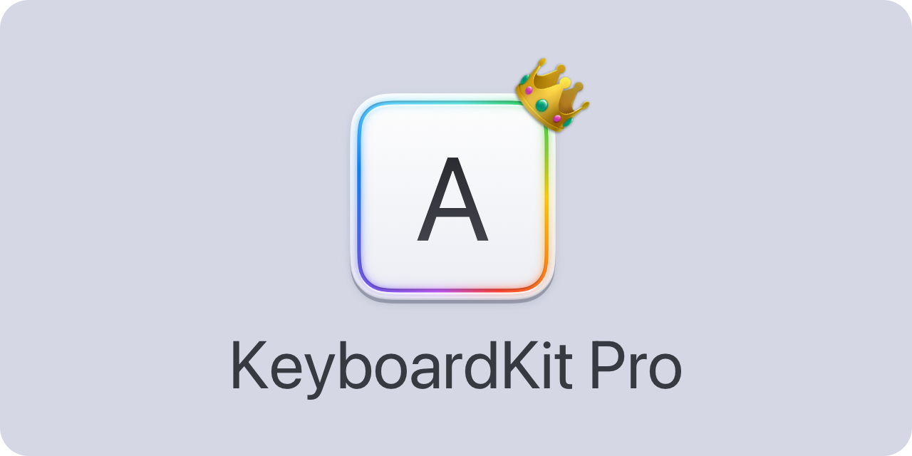

# KeyboardKit Pro

<p align="center">
    
</p>

<p align="center">
    
    
    
    
    <a href="https://twitter.com/danielsaidi">
        
    </a>
</p>


## About KeyboardKit Pro

[KeyboardKit][KeyboardKit] is a Swift library that helps you create custom keyboard extensions for `iOS` and `iPadOS`, using `SwiftUI`. 

KeyboardKit Pro is a license-based plug-in that extends KeyboardKit with pro features, such as localized services, autocomplete etc.


## Installation

KeyboardKit Pro can be installed with the Swift Package Manager:

```
https://github.com/KeyboardKit/KeyboardKitPro.git
```

KeyboardKit Pro only needs to be added to the main app target.


## Getting started

Once KeyboardKit is added to your project, you need to obtain a license before you can start using it in your application.

[Read more here][Getting-Started]


## Documentation

The KeyboardKit Pro documentation contains extensive information, code examples etc. and makes it easy to overview the various parts of the library.

You can either [download][Documentation] the documentation or build it directly in Xcode, using `Product/Build Documentation`.


## Features


### 🏳️‍🌈 Locales

KeyboardKit Pro adds completely localized keyboard services for the following locales:

* 🇺🇸 English

* 🇦🇱 Albanian
* 🇦🇪 Arabic
* 🇧🇷 Brazilian
* 🇩🇰 Danish
* 🇳🇱 Dutch
* 🇬🇧 English (UK)
* 🇺🇸 English (US)
* 🇪🇪 Estonian
* 🇫🇮 Finnish
* 🇫🇷 French
* 🇩🇪 German
* 🇮🇸 Icelandic
* 🇮🇪 Irish
* 🇮🇹 Italian
* 🇹🇯 Kurdish Sorani
* 🇱🇻 Latvian
* 🇱🇹 Lithuanian
* 🇳🇴 Norwegian
* 🇮🇷 Persian
* 🇵🇱 Polish
* 🇵🇹 Portuguese
* 🇷🇺 Russian
* 🇪🇸 Spanish
* 🇸🇪 Swedish
* 🇹🇷 Turkish
* 🇺🇦 Ukrainian

The number of available locales is based on your license. The available license tiers can be found on the [KeyboardKit website][Licenses].


### 💡 Autocomplete

KeyboardKit Pro adds an autocomplete engine that supports all locales above. It also has a web-based autocomplete engine that fetches suggestions from a remote web service or api. 

[Read more here][Autocomplete]


### 🔤 Input Sets

KeyboardKit Pro adds locale-specific input sets for all locales above.


### 🗯 Secondary Actions

KeyboardKit Pro adds locale-specific secondary callout actions for all locales above.


### 🖼 Views

KeyboardKit Pro adds additonal views that simplifies building greater keyboard apps.

[Read more here][Views]


## Contact

Feel free to reach out if you have questions or feedback:

* E-mail: [info@getkeyboardkit.com][Email]
* Twitter: [@getkeyboardkit][Twitter]
* Website: [getkeyboardkit.com][Website]


## License

KeyboardKit Pro is closed source. See the [LICENSE][License] file for more info.


[Email]: mailto:info@getkeyboardkit.com
[Twitter]: http://www.twitter.com/getkeyboardkit
[Website]: https://getkeyboardkit.com
[Licenses]: https://getkeyboardkit.com/pro

[Documentation]: https://github.com/danielsaidi/Documentation/blob/main/Docs/KeyboardKitPro.doccarchive.zip?raw=true
[KeyboardKit]: https://github.com/KeyboardKit/KeyboardKit

[Autocomplete]: https://github.com/KeyboardKit/KeyboardKitPro/blob/master/Readmes/Autocomplete.md
[Getting-Started]: https://github.com/KeyboardKit/KeyboardKitPro/blob/master/Readmes/Getting-Started.md
[License]: https://github.com/KeyboardKit/KeyboardKitPro/blob/master/LICENSE
[Views]: https://github.com/KeyboardKit/KeyboardKitPro/blob/master/Readmes/Views.md
